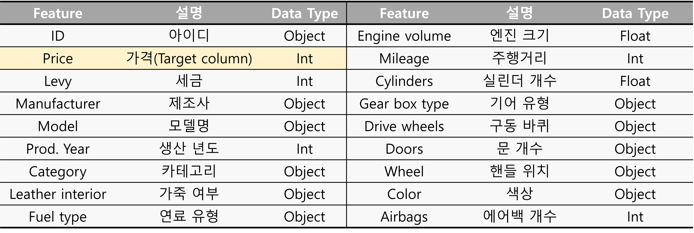
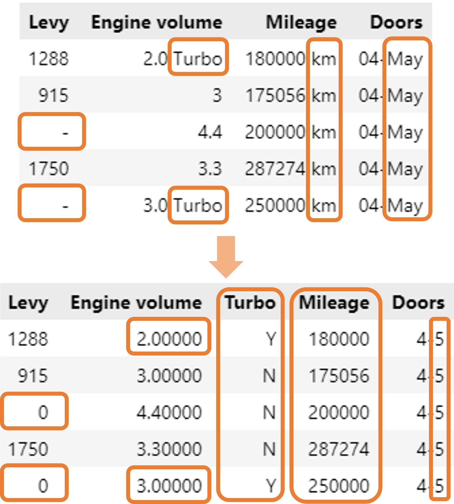
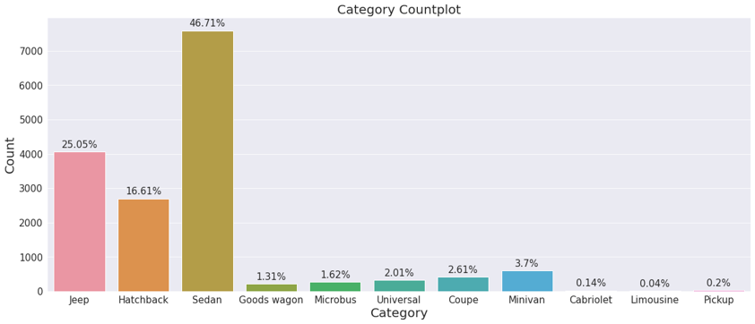
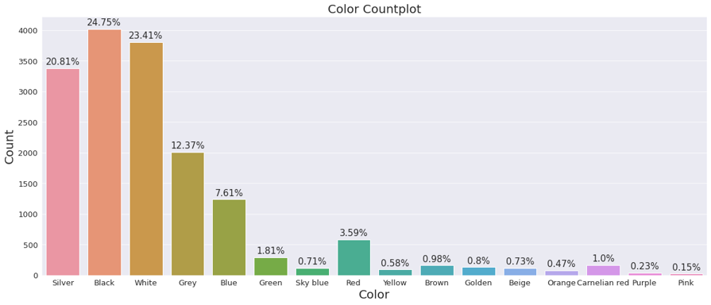
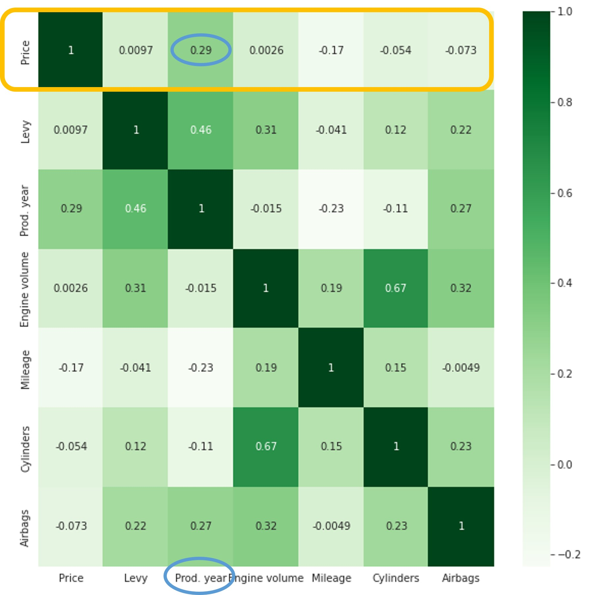
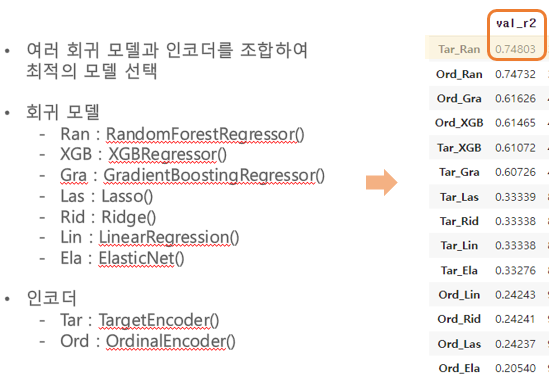
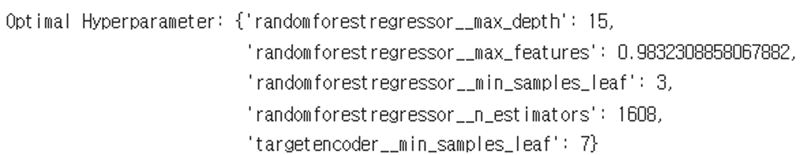
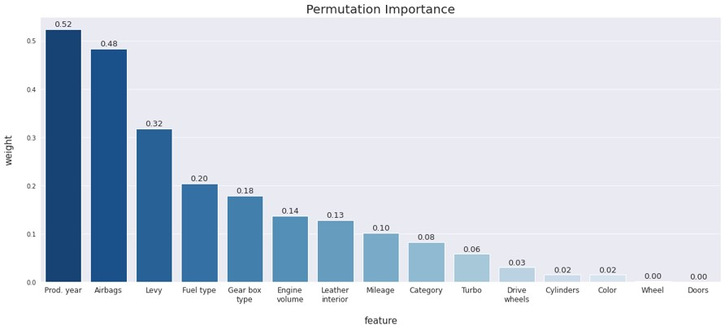
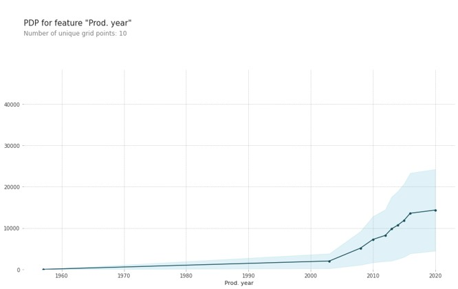
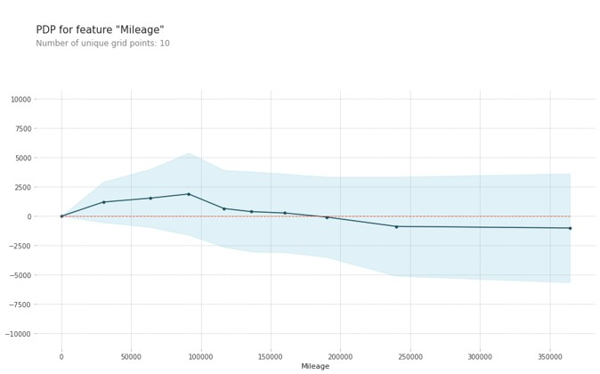

# **🚗중고차 가격 예측 모델🚗**
------
## **📝프로젝트 개요**
- 현재 고금리로 중고차 시장이 시세 혼란기를 겪고있어 전문가들은 중고차 매매시 비교 견적이 필수라고 조언하고 있다. 때문에 중고차 가격 예측 모델을 통해 중고차 가격에 어떤 요소들이 영향을 미치는지 파악해보고자 함.
------
## **💻사용 기술**
- 

------
## **📂사용 데이터**
- Kaggle < Car Price Prediction >
- 변수 설명
    
    
------
## **➡️진행 과정**
------
### **1) 가설 설정**
1. Engine volume이 가격에 가장 큰 영향을 미칠 것이다.
2. Engine volume이 클수록 가격이 높을 것이다.
3. 최근 생산된 자동차일수록 가격이 높을 것이다.
4. 주행거리가 많을수록 가격이 낮아질 것이다.

### **2) 기준 모델 및 평가 지표 설정**
- 기준 모델 : Target값인 Price의 **평균값**
- 평가 지표 : **R2 Score**
    > **R2 Score** : R2 Score는 회귀 모델의 성능에 대한 평가지표로 0에서 1 사이의 범위를 가지며 1에 가까울수록 좋은 모델을 나타낸다고 할 수 있다.
    
### **3) 데이터 전처리 및 Feature Engineering**

- 중복 데이터 313개 삭제
- 필요없는 컬럼 삭제(ID 컬럼)
- 높은 카디널리티를 가지는 컬럼 삭제(Model : 1364개, Manufacturer : 60개)

- Levy 변수 중 일부 데이터 값에 '-'이 포함됨 ☞ '-'을 0으로 변경
- Engine volume 변수 중 일부 데이터 값에 ‘Turbo’ 글자가 포함됨 ☞ ‘Turbo’를 삭제하고 Turbo 엔진 여부를 판단하는 Turbo 변수를 새롭게 생성
- Mileage 변수 값의 km 단위 글자 삭제
- Doors 변수 중 일부 데이터 값의 오류 ☞ '02-Mar'은 '2-3'으로, '03-May'는 '4-5'로, '>5'는 '5+'로 수정

    

- 이상치를 포함하는 데이터 삭제

    

### **3) EDA**
- Category : Sedan 46.7% > Jeep 25.1% > Hatchback 16.6%
    

- Color : Black 24.8% > White 23.4% > Silver 20.8%
    

- Fuel Type : Petrol 51.4% > Diesel 21.6% > Hybrid 20.4%
    

- 연속형 변수 상관관계 Heatmap : 타겟값 Price와의 상관계수가 가장 높은 변수는 생산년도(Prod. Year)이다.
    

### **3) 모델 학습 및 파라미터 설정**
1. 데이터를 Train / Validation / Test set으로 6:2:2 비율로 분리

    
2. 여러 회귀 모델과 인코더를 조합하여 최적의 모델 선택

    
    
    - R2 Score가 가장 좋은 TargetEncoder와 RandomForestRegressor 조합을 선택하여 모델링 진행

3. RandomizedSearchCV로 최적의 하이퍼파라미터 찾기
    
    - RandomForestRegressor
        - max_depth : 15 (트리의 최대 깊이)
        - max_features : 0.98 (최적의 분할을 위해 고려할 최대 피처 수)
        - min_samples_leaf : 3 (리프노드가 되기 위해 필요한 최소한의 샘플 데이터 수)
        - n_estimators: 1608 (결정트리의 개수)
    - TargetEncoder
        - min_samples_leaf : 7

4. 최적의 파라미터를 적용하여 모델 학습 및 검증 후 최종적으로 테스트 셋을 이용해 모델을 예측한 결과
    - Train set R2 Score : 0.72
    - Validation set R2 Score : 0.74
    - **Test set R2 Score : 0.76**
5. 가설 검증

    1. Permutaion Importance

        : 모델 예측에 가장 큰 영향을 미치는 Feature 를 파악하는 방법

        

        - 중고차 가격에 가장 큰 영향을 미치는 요소는 Engine volume이 아닌 생산년도이다.
        - 생산년도 > 에어백 수 > 연료 유형 > 기어 유형 순서로 영향도가 높음
 
    2. PDP
        
        : 예측 모델을 만들었을 때, 어떤 특성이 예측모델의 타겟 변수에 어떤 영향을 미쳤는지 알 수 있는 그래프

        
        
        - Engine volume이 클수록 가격이 높아진다.

        

        - 생산년도가 최근일수록 가격이 높아진다. 

        
        
        - 주행거리가 많을수록 가격이 낮아진다.

     
---
## **📌최종 결과**
- 모델 Test set R2 Score : 0.76
- 가설 검증
    1. Engine volume이 가격에 가장 큰 영향을 미칠 것이다. 
        
        ➔ X : 중고차 가격에 가장 큰 영향을 미치는 요소는 Engine volume이 아닌 생산년도이다.
    2. Engine volume이 클수록 가격이 높을 것이다. ➔ O
    3. 최근 생산된 자동차일수록 가격이 높을 것이다. ➔ O
    4. 주행거리가 많을수록 가격이 낮아질 것이다. ➔ O

---
## **✍️성과 및 추후 개선하고 싶은 점**
- 머신러닝을 통한 데이터 분석으로 구축한 중고차 가격 예측 모델로
추후 고객들에게 신뢰도 있는 중고차 가격 비교가 가능할 것
- 최근 시세 혼란기를 겪고있는 중고차 시장에서
신뢰도 있는 가격비교는 '좋은 값'을 미끼로 던지는 중고차 사기를 피할 수 있는 좋은
수단이 될 수 있다고 생각
- 더 세밀한 데이터 전처리와 모델 성능 개선 필요

